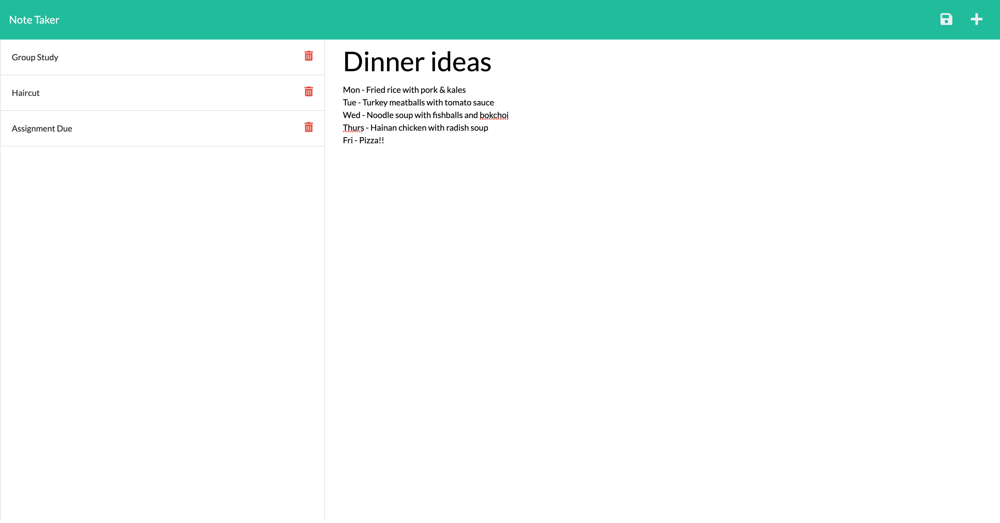

# Note-Taker
Users can add, retrieve and delete notes. 

## Table of Contents
1. [Descriptions](#descriptions)
2. [Tech used](#tech-use)
3. [Visuals](#visuals)
4. [Link](#link) 

## Descriptions
For users : A simple but essential app. Life can get hectic and overwhelme with activities and responsibilities. This easy to use app allows the user to add, retrieve and delete notes. Make it convenient to check the future event or track past activities. 
For developers : This app is focusing on the backend by using Express.js which provides a robust set of features for web applications. 

## Tech Use
* HTML
* CSS
* Bootstrap
* Express.js
* NPM
* Heroku

## Visuals

```pip
Note-Taker Web Application
```


```pip
Users can write new note by clicking on the "+" symbol on the top right corner.
```


```pip
Notes can be saved by clicking on the save button on the top right corner. This will appear when user starts adding note details. To delete notes, simply click on the bin image next to the saved notes on the left hand side.
```




## Link
[Heroku](https://stormy-meadow-83428.herokuapp.com/)